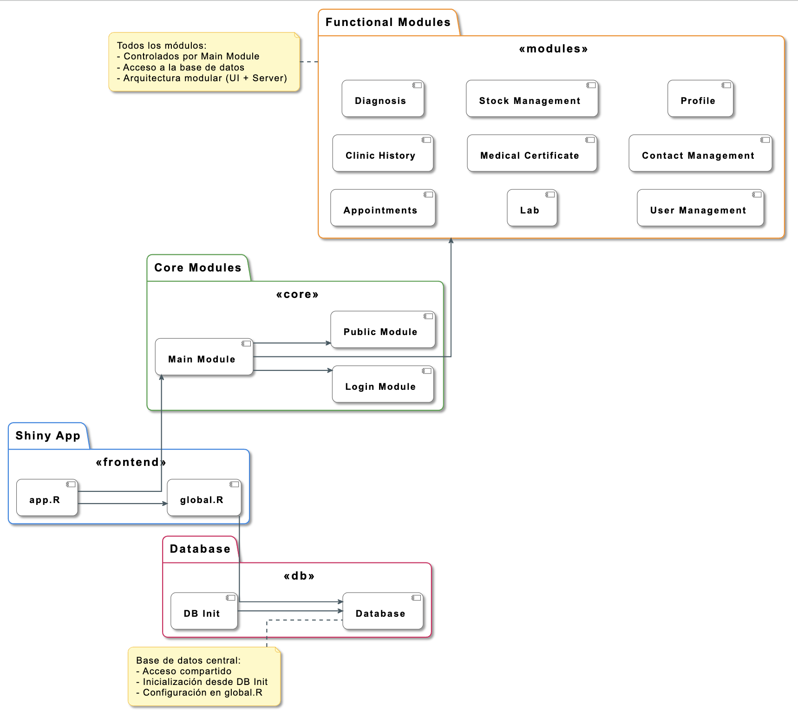
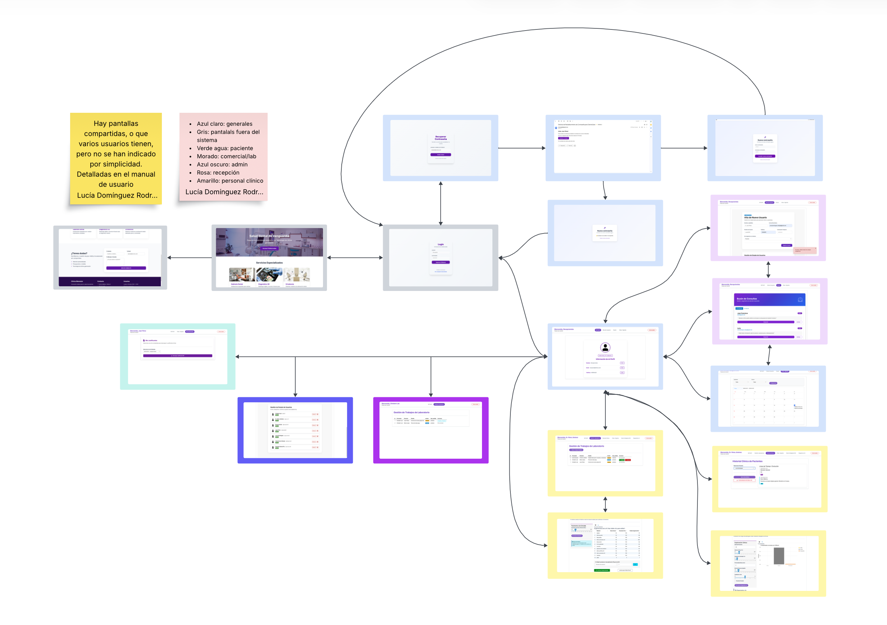

# 🏥 OdontoGest: Intelligent Clinical Management System with CDSS and RAG-based AI

[](https://shiny.posit.co/)
[]([https://www.salesforce.com/products/einstein/agentforce/](https://www.salesforce.com/es/agentforce/))
[]()
[]()

**OdontoGest** is a comprehensive clinical management platform for dental clinics that transforms the traditional reactive management approach into a **proactive, data-driven paradigm**. It integrates a robust web architecture with a **Clinical Decision Support System (CDSS)** powered by Machine Learning and an AI assistant utilizing **Retrieval-Augmented Generation (RAG)**.

---

## 🌐 Live Application

The OdontoGest platform is deployed and accessible online via Heroku.

You can access the live application here:

👉 https://clinic-app-tfg-c59c7bed5b0b.herokuapp.com/

---
## 📂 Project Structure & Branching Strategy

The repository is organized into two main branches to separate the development environment from the production-ready deployment.

---

## 🌿 Branching Strategy

### `main` branch
Contains the full development environment, including:

- Local development tools
- Raw datasets
- Model training scripts
- Full documentation

### `deployment` branch
Contains a streamlined, production-ready version optimized for **Heroku deployment**.  
This branch includes:

- `ClinicAppTFG` core application
- Docker configuration
- Production-specific environment settings
- Lightweight dependencies required for execution


## 📁 Directory Structure (main branch)

```plaintext
├── .github/workflows/       # CI/CD pipelines (GitHub Actions)
├── ClinicAppTFG/            # 📦 Core Shiny Application
│   ├── modules/             # UI/Server logic decoupled by functionality
│   ├── tests/               # Unit and integration tests
│   ├── www/                 # Static assets (CSS, Images, JS)
│   ├── app.R                # Application entry point
│   ├── global.R             # Global variables and library loading
│   └── db_init.R            # Database connection and pooling logic
├── modelos/                 # 🧠 Machine Learning Research
│   ├── modeloDiagnostico/   # XGBoost training scripts and saved weights
│   ├── modeloStock/         # Linear Regression scripts for inventory
│   └── comparacion/         # Model evaluation metrics and SHAP analysis
├── docs_readme/             # Documentation assets and diagrams
├── .gitignore               # Files excluded from version control
└── README.md                # Project documentation

```

## 🧩 Module Architecture

| Module | Description |
|--------|-------------|
| `appointments` | Scheduling system |
| `clinic_history` | Patient clinics records management |
| `diagnosis` | CDSS interface (XGBoost-based) |
| `stock_management` | Inventory forecasting system |
| `user_management` | User creationn, deletion and ban/unban functions |
| `medical_certificate` | Medical certificate generation as a PDF for patients |
| `contact_management` | Management of the contact form and the response to it |
| `index` | Main page, function as orchestrator |
| `lab` | Comercial and labs functionality |
| `login` | login/logout functionality |
| `profile` | Manage profile info and changes on it|
| `public` | Landing page|
| `reset_password` | Manage reset password logic|



### 💡 Design Principles

#### 🔒 Isolation
Training models and datasets are separated from the production codebase in order to reduce application weight, improve security, and ensure a clean deployment environment.


#### ⚙️ Scalability
Each feature is implemented as an independent module, preventing monolithic architecture and allowing the system to scale and evolve without structural complexity.


#### 🚀 Deployment Ready
The `deployment` branch represents a production-optimized build of the system, specifically configured for deployment on **Heroku** with only the necessary runtime components.

---

## 🖥️ Local Deployment

To run the application locally, you need to download the project repository and install the required dependencies.


### 📥 Step 1: Download the repository

Clone or download the repository from GitHub:

```bash id="c2k9ld"
git clone https://github.com/your-repo/odontogest.git
cd odontogest
```
## 📦 Step 2: Install required dependencies

The application is built in **R (Shiny framework)** and requires a set of packages used across the UI, backend, CDSS models, and AI integration modules.

You can install all required packages in R using:

```r id="r8k2ld"
install.packages(c(
  "shiny", "DBI", "pool", "RMariaDB", "dplyr", "ggplot2",
  "httr", "jsonlite", "toastui", "shinyWidgets", "emayili",
  "rmarkdown", "pagedown", "caret", "xgboost", "bcrypt",
  "htmltools", "webshot2", "base64enc", "shinyjs", "DT",
  "tidyr", "openxlsx", "bslib", "plotly", "dotenv", "digest",
  "mailR", "sodium", "shinycssloaders", "MLmetrics", "shinyalert"
), repos = "https://cran.rstudio.com/")
```
## 🚀 Step 3: Run the main application

To launch the full **OdontoGest system**, navigate to the main application folder and run:

```r id="r7k2ld"
setwd("ClinicAppTFG")
shiny::runApp("app.R")
```

## 🧠 Step 4: Run Machine Learning models (optional)

Each machine learning model is implemented as an independent Shiny application.

To execute a model individually:

- Navigate to the corresponding folder inside `modelos/`
- Open the `app.R` file
- Run it in R or RStudio

### Example:

```r id="r2k8ld"
shiny::runApp("modelos/modeloDiagnostico/app.R")
```

### ⚠️ Important Notes (Database Configuration)

This application requires a **MySQL database** to function correctly, as it is used for patient records, appointments, inventory management, and clinical data storage.


#### 🗄️ MySQL Requirement

Before running the application locally, ensure that:

- A **MySQL server is installed and running**
- A valid database instance is available
- Connection credentials are properly configured


#### 🔐 Environment Variables (.env)

To run the project locally, you must configure your own `.env` file with the required database credentials and system variables.

Example `.env` structure:

```env id="m9k2ld"
DB_HOST=localhost
DB_PORT=3306
DB_NAME=odontogest
DB_USER=root
DB_PASSWORD=your_password
```

---
##  Key Value Propositions

### 🏗️ Advanced Software Engineering
* **SPA Architecture (Single Page Application):** Implemented using dynamic navigation, History API integration, and `sessionStorage` to maintain state across the R Shiny environment without page reloads.
* **Modular Design:** Strictly decoupled architecture using *Namespacing*, ensuring high maintainability, testability, and scalability.
* **Granular RBAC:** Role-Based Access Control managing 8 distinct profiles (Doctor, Hygienist, Patient, Admin, Receptionist, Laboratory, Commercial, and Visitor).

### 🧠 Intelligence & Decision Support (CDSS)
* **Inventory Forecasting:** A log-linear regression model (`caret`) that predicts monthly supply demands to prevent stockouts.
* **Diagnostic Assistance:** An **XGBoost** classifier trained to assist in periodontal disease severity assessment.
* **Explainable AI (XAI):** Integration of **SHAP values** to provide clinical transparency, allowing doctors to understand the "why" behind every AI suggestion.

### 🤖 Generative AI: Agentforce & RAG
The system features **"Dientecito"**, an intelligent agent orchestrated via the Salesforce ecosystem:
* **RAG Pipeline:** Extracts semantic knowledge from clinical guidelines and nutritional protocols (PDFs) to generate grounded, hallucination-free responses.
* **Atlas Reasoning Engine:** Interprets user intent and dynamically selects the correct knowledge topics.
* **Einstein Trust Layer:** Ensures clinical data privacy by anonymizing sensitive information before processing.

---

## 🛠️ Technology Stack

| Layer | Technologies | Description |
| :--- | :--- | :--- |
| **Backend Architecture** | R 4.x, Shiny, R6, Pool (DB connection pooling), DBI | Core server logic built on reactive programming with Shiny, ensuring modularity, scalability, and efficient database connection management through pooling strategies. |
| **Data Science & AI** | `caret`, `xgboost`, `fastshap`, `MLmetrics`, `ggplot2`, `tidyverse` | Machine learning pipeline for predictive modeling, including clinical diagnosis (XGBoost), inventory forecasting (regression models), and model explainability using SHAP values. |
| **Database Layer** | MySQL / MariaDB, PostgreSQL (compatible), JawsDB (production) | Relational database architecture for persistent storage of clinical records, appointments, inventory, and user management with secure pooled connections. |
| **Security & Authentication** | BCrypt, Sodium, secure session cookies, dotenv | Multi-layer security approach including password hashing, token-based authentication, environment variable isolation, and session protection mechanisms. |
| **AI & External Integration** | Salesforce Agentforce, Einstein Data Cloud, RAG pipeline, Tampermonkey bridge | Integration of generative AI using Retrieval-Augmented Generation (RAG), secure browser-level injection for Agentforce, and orchestration via Salesforce Atlas reasoning engine. |
| **Frontend & UI Layer** | Shiny modules, HTML5, CSS3, JavaScript, `shinyjs`, `bslib`, `shinyWidgets` | Modular and reactive UI design enabling dynamic SPA-like behavior within Shiny, with enhanced interactivity and role-based rendering. |
| **DevOps & Deployment** | Docker, Heroku, GitHub Actions (CI/CD), buildpacks | Fully containerized deployment pipeline ensuring reproducibility across environments, automated CI/CD workflows, and scalable cloud deployment on Heroku. |
| **Reporting & Documents** | `rmarkdown`, `pagedown`, `webshot2`, LaTeX | Automated generation of clinical PDFs, reports, and certificates with LaTeX-based rendering and headless browser PDF export. |


---

## 👥System Roles

### 👤 Visitor
Unauthenticated user.
- Access to the home page.
- Contact form access.


### 🧑‍⚕️ Patient
Restricted access to their own information.
- Manage appointments.
- Update profile.
- Download medical assistance certificates.
- For security reasons, if a patient wishes to obtain a copy of their clinical history, it must be provided by authorized clinical staff.


### 🏥 Receptionist
Operational core of the system.
- Manage the global schedule
- Handle the inbox from the contact form
- Create/Delete user accounts 
- ❌ No access to sensitive clinical data (e.g., diagnoses)


### 👨‍⚕️ Clinical Staff (Doctor / Hygienist)
Users with access to clinical systems.
- Use the Clinical Decision Support System (CDSS) that includes  Machine Learning models for:
  - Diagnostics
  - Inventory management
- Visualize, edit and download Patients Clinical History (understanding editing as addding new clinical notes)
- Visualize order status (both protesic and stock orders). Also update the order status (in the case that the order must be returned, indicate why).
- Visualize the calendar, with the data for each appointment. If the appointment has already occurs, add clinical relevant notes.
- Update profile info.


### 🛠️ Administrator (Admin)
Superuser with full system access.
- Full system auditing
- Manage user status (Ban / Unban)
- Access to all modules


### 🧪 Commercial / Laboratory (Lab)
External role with limited access.
- Access the order management module
- Update manufacturing status
- Provide tracking information
- ❌ No access to clinical or personal data

---


## 🧭 Application Navigation Overview

This diagram provides a **high-level overview** of the application's navigation structure.

It is intended to give a general understanding of how users move through the system and how the main modules are organized.

### 📝 Notes
- This is a **simplified representation** of the system.
- Some screens are **shared across multiple user roles**, but are not duplicated in the diagram for clarity.
- These shared views and detailed flows are fully described in the **User Manual**.

### 🎨 Legend (Color Coding)

The diagram uses color coding to represent access by different user roles:

- 🔵 **Light Blue**: General screens (shared/common)
- ⚪ **Grey**: External screens (without login)
- 🟢 **Light Green**: Patient
- 🟣 **Purple**: Commercial / Laboratory
- 🔷 **Dark Blue**: Administrator
- 🌸 **Pink**: Receptionist
- 🟡 **Yellow**: Clinical Staff

### 🗺️ Navigation Diagram



---
## 🤖 Predictive Models Overview

This system integrates two Machine Learning models designed to support both **clinical decision-making** and **operational management** within the clinic.

The architecture follows a **problem-specific modeling approach**, where each model is selected based on the nature of the task, prioritizing **robustness, interpretability, and reliability**.

---

### 🧠 Model 1: Stock Demand Prediction

#### 📌 Objective
Estimate future material demand in order to optimize inventory management and avoid:
- Overstock (resource waste)
- Stock shortages (treatment delays)

#### ⚙️ Selected Model
- **Linear Regression**

#### ✅ Justification
Although more complex models (Random Forest, XGBoost) were evaluated, Linear Regression was selected due to:

- Better generalization
- Robustness to noise
- Stability in predictions
- High interpretability
- Low computational cost

---

### 🏥 Model 2: Clinical Diagnosis Support

#### 📌 Objective
Support clinical staff in the preliminary classification of patients.

> ⚠️ **Adaptation for application integration**  
> Although the model was originally developed to classify patients into four severity levels  
> (**Normal, Mild, Moderate, Severe**), for integration into the application it has been  
> **adapted to clinically meaningful categories**:
>
> - **Healthy (Normal)**
> - **Caries**
> - **Periodontitis**

This mapping allows the model outputs to be directly aligned with real clinical workflows and usability within the system.

#### ⚙️ Selected Model
- **XGBoost (Gradient Boosting)**

#### ✅ Justification
- High predictive performance
- Strong sensitivity in critical cases
- High specificity in healthy patients
- Ability to model complex, non-linear relationships
- Robustness under cross-validation

#### ⚠️ Clinical Considerations
- The model is designed to **assist**, not replace, clinical judgment
- Special care is taken to minimize **false negatives in severe conditions**


### 🔍 Model Interpretability

- SHAP (SHapley Additive Explanations) is used to explain predictions
- Key variables such as **age** and **glucose levels** drive model decisions
- Each prediction can be broken down into feature contributions


### 🔒 Usage and Access

- Accessible only by **Clinical Staff**
- Integrated within the **Clinical Decision Support System (CDSS)**
- Outputs are intended as **decision support**


### ⚠️ Limitations

- Dependent on data quality
- Higher uncertainty in intermediate cases
- Requires continuous validation


### 🔄 Future Improvements

- Integration of real clinical datasets
- Improved classification granularity
- Inclusion of additional clinical variables

---
## ☁️ AI Assistant Agent: Salesforce Agentforce Integration (via Tampermonkey)

The application features an intelligent assistant powered by Salesforce Agentforce. To seamlessly integrate the Salesforce chat capabilities into the web frontend without modifying the core production build during the testing phase, a Tampermonkey script approach was utilized.

### ⚙️ Integration Workflow

#### 🧩 Script Injection
A custom userscript (Tampermonkey) is used to inject the Salesforce Embedded Messaging Bootstrap directly into the browser session.

#### 🔐 Initialization
The script handles the following configuration values to establish a secure connection with Salesforce Service Cloud:

- `ORG_ID`
- `DEPLOYMENT_NAME`
- `SITE_URL`

### 🚀 Key Capabilities

- 💬 Real-time queries regarding clinic treatments specifications
- 🔄 Personaliced dental routines

---

## 🚀 Deployment on Heroku and Buildpacks

The platform is deployed using **Heroku**, a Platform-as-a-Service (PaaS) that enables seamless application deployment, scalability, and maintenance in the cloud without requiring direct infrastructure management.

### ⚙️ Deployment Strategy

The application follows a container-based deployment approach combined with buildpacks, which automate the environment preparation before the application is executed.

This strategy ensures:

- 🔄 **Reproducible deployments** across different environments (development, testing, and production).
- 📦 **Automated management of system and R dependencies**.
- ⚙️ **Horizontal scalability** handled natively by Heroku.


### 🧱 Buildpacks Used

To properly configure the execution environment, the following buildpacks are used:

- `heroku-community/apt`  
  Enables the installation of low-level system dependencies required by the application.

- `heroku-buildpack-r`  
  Handles the installation, compilation, and optimization of the R runtime environment in the cloud.


### 🗄️ Data Persistence

Data persistence is managed using the **JawsDB MySQL** add-on, which provides a fully managed external relational database service.

This approach allows:

- 🔒 Separation between application logic (Shiny server) and data storage.
- 📊 Secure storage of sensitive clinical data, such as patient records.
- ☁️ Independent scalability of the database layer.


### 📌 Architectural Considerations

Thanks to this deployment strategy:

- The application can scale dynamically based on user demand.
- Production environment maintenance is significantly simplified.
- High system availability is ensured in the cloud.

---

## 📘 User Manual

A complete **User Manual** for the application is available, providing detailed explanations of system usage, workflows, and functional modules.

This documentation includes step-by-step guidance for each user role, helping users understand how to interact with the platform effectively.

📂 You can access the full manual and supporting documentation here:

📄 [User Manual](./docs_readme/Manual%20de%20uso%20OdontoGest.pdf)

---
## 🎥 Video Tutorials (YouTube Channel)

A dedicated **YouTube playlist** has been created containing step-by-step video tutorials on how to use the OdontoGest application.

These videos cover key workflows, system navigation, and role-based usage of the platform to support both onboarding and daily operation.

📺 Access the playlist here:

👉 https://www.youtube.com/playlist?list=PLrmyvPQXD7ZzwvdFQjzUq0tzJ-3yJP1HQ
